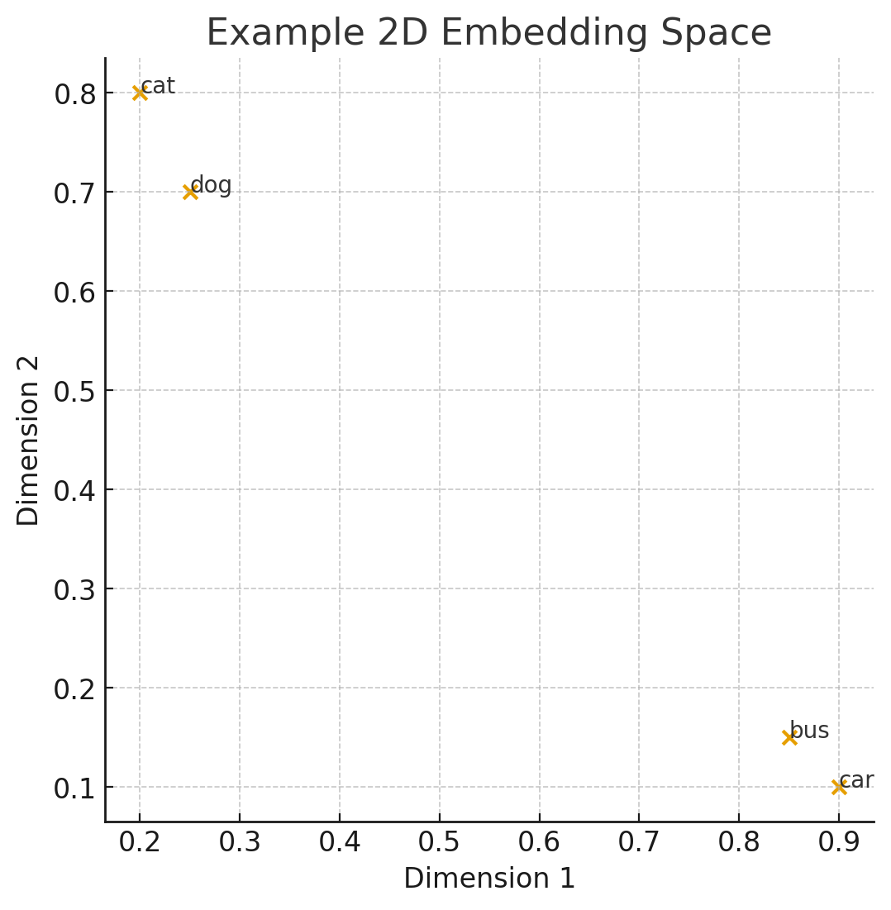
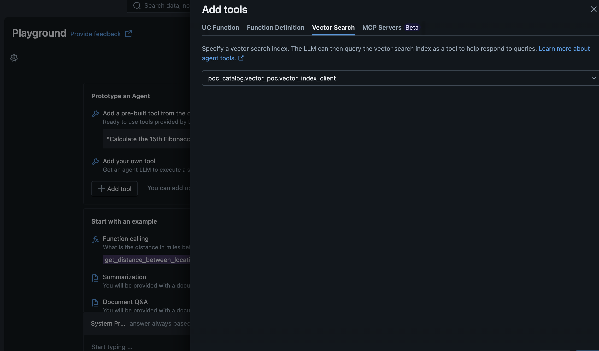
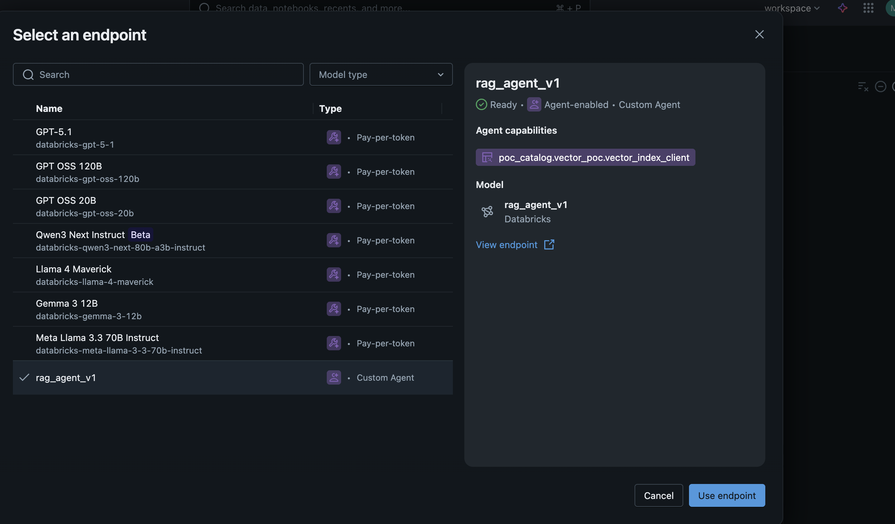
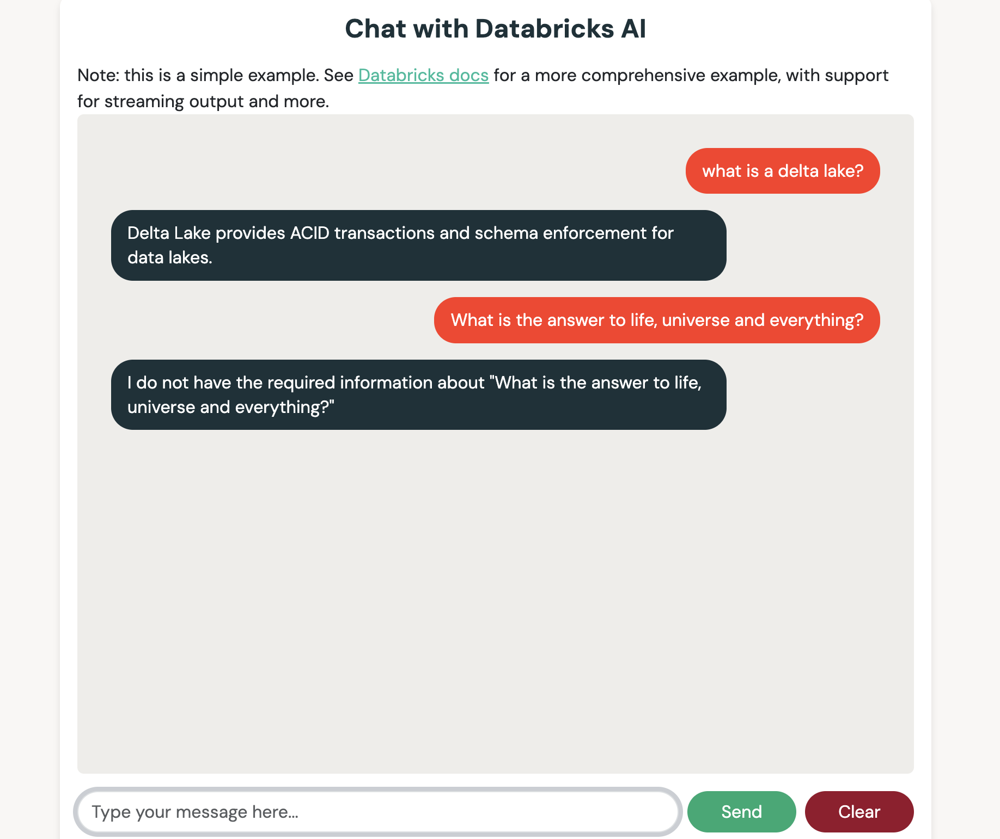

# Vector search embedding in databricks
## Plan and documentation
The goal of this PoC is to identify usage and benefit of storing embeddings on databricks to serve a model. We will try implementing a pipeline for the ingestion of new data to feed LLM model. <br>
- [databricks documentation](https://docs.databricks.com/aws/en/generative-ai/create-query-vector-search)
- [databricks vector search modules](https://api-docs.databricks.com/python/vector-search/index.html)


## Workflow
We are going to create a vector search entity in databricks (via UI or python SDK). Creation od the delta table with the data to embed. Creation of the index in the vector search based on some target columns in the delta table. Querying of the index based on the embedding model. Serving of the embedding index to a language model via RAG.
Once all the individual element will be understood we are going to deploy an end to end pipeline that will update the embedding for the target model.


## Setup databricks
### Creation of the vector search and index
Vector search are endpoint setup in databricks compute pages. They require unity catalog enabled workspace and serverless compute available (it is possible to specify the serverless policy).
The vector search can then include multiple index which will effectively contain our embeddings. <br>
By navigating to any delta table from catalog, is possible to create from UI the index. In the settings we need to specify the primari identifier column and the text colums or directly the column containing the vector itself. This is useful when we want to perform some tests from UI, in our example tutorial we will focus on creating both the vector endpoint and the indexes in a more consistent way via databricks SDK.
1. Creation of the dataset and table
2. Creation of the vector search endpoint
3. creation of the index uisng databricks embedding model

Alternatively to the last step is also possible to use custom model (downloaded form hugginface or available in the catalog). is also possible to serve a model for embedding directly in databricks.

Notes:
- creation of the index require that on the table change data feed is enabled

### Using the index
Once the index is created we can make use of it either directly from databricks unity catalog (going to the index and selecting query index), include it as resource for RAG in playground (in the future even in agent bricks) or can be integrated and queried externally (a we will see in the last phase of this POC).

### How vector index works
Going on a lower level on how querying an index works, we should focus on two fundamental concepts:
- embedding -  refers to the phase in which string of text are converted into array of float of n dimension. 
- vector similarity - is the process used to effectively query the index by computing distance between two embedding vector

A vector database is nothing more than a table holding the string of text and the relative embedded vector. To generate the vector we use an embedding model (transformermlike GTE or BERT), assuming the text was already procesed and tokenized (divided in smaller chunks of understandable concept) the model will now process over the individual token to first identify meaning of it and then will go over smaller subset of tokens to capture context and generate a vector representing the sentence in a n-dimensional space.
Usually some post processing (poooling) is needed when embedding multiple sentence in a single vector.

We know now how to encode some text in a vector, let's assume we have two vector representing the semantic model of two word (*cat* and *dog*) in a 2 dimensional space (our vector are just point now). We could now measure the distance between these words, this is the mechanism used to query an index: smaller distance represent similar semantic items.
Let's introduce two other world (*bus* and *car*)

We can now clearly see that semantically similar words are clustered togheter.

## Databricks Agentbricks
To make use of index in AI context we work in the playground by adding the specific *tool* for vector search.

Or alternatively we can create the agent via code, directly from the playground we can set the tools we want to use (or crreate new one as UC function or setup MCP servers), the system prompt and then by clicking on `Get code` it will automatically generate two files:
- driver.ipynb
- agent.py

Driver contains import to the model, setup of the experiment and judge in MLflow, invokation to the model and registration of the model as unity catalog entity.
Agent define the tool calling (is possible to specify additional function as from the UI), system prompt and the agent object itself.

Once we are satisfied with the test and experiment session we can then register the model. The model will appear in the specified schema and also in the model tab of AI/ML. We can now serve assign permissions, tag and relese (serve) the model, specifying the computr type and policy. Other than UI should be possible to [python sdk](https://databricks-sdk-py.readthedocs.io/en/stable/workspace/serving/serving_endpoints.html) to serve the model.
Having the model served we can both reach it as an external service or play with it using databricks playground.


### Notes on agentbricks
Agentbricks works in a similar way, allowing user to create agent from pre-refined template usign built in tools from databricks. On lower level is also possible to create agent from code, using the same kind of syntax and files. Agent bricks add another layer of abstraction giving this template for some common use case.


#### Note on ML flow functinality
MLflow in Databricks is an open-source platform designed to manage the end-to-end machine learning lifecycle. It helps data scientists and engineers track experiments, package models, and deploy them efficiently, all within the integrated Databricks environment.

**Major functionalities include:**
- **Experiment Tracking:** Log parameters, metrics, artifacts, and code versions for reproducibility.  
- **Model Registry:** Store, version, review, and manage ML models in a centralized repository.  
- **Model Packaging:** Package ML code as reusable and shareable components.  
- **Model Deployment:** Deploy models to various environments, including batch, streaming, or real-time endpoints.  
- **Integration with Databricks:** Seamless use with notebooks, workflows, and collaborative ML development.


## Local integration
In this phase we will show off how a RAG system will work. We need first download the model to use. For this POC [google flan-t5-base](https://huggingface.co/google/flan-t5-base) is our target. A fine tuned version of google T5 model with 250 Million parameter that can easily run on cpu if we have at least 1.5gb or memory available. It is complex enough to understand our  prompt and follow the given instrucitons.
### Setup local model
To setup a small language model locally we actually need to load the model into memory and store the cache into a models directory. We will execute the following in a shell
```
mkdir -p models
python3 -c "from transformers import AutoTokenizer, AutoModelForSeq2SeqLM; \
import warnings; \
import urllib3; \
from huggingface_hub import snapshot_download; \
from dotenv import load_dotenv; \
import os; \
load_dotenv(); \
MODEL_ID = os.environ.get('MODEL_ID', 'google/flan-t5-small'); \
CACHE_DIR = 'models'; \
os.environ['CURL_CA_BUNDLE'] = ''; \

warnings.filterwarnings('ignore', category=urllib3.exceptions.InsecureRequestWarning); \
warnings.filterwarnings('ignore'); \
SNAPSHOT_PATH = snapshot_download(repo_id=MODEL_ID, cache_dir=CACHE_DIR); \
print(f'\n\n \nFinal Snapshot Path: {SNAPSHOT_PATH}\n\n');"
```
The final printed row will contain the models cache path to be used to launch the backend API, so copy it and paste it in the .env file

### Databricks token
In order to access the vector index search and use databricks api we will need to generate a token going to Databricks workspace -> Settings -> Developer -> Access tokens.
After the creation remember to edit the .env file.
### Run backend server
Having the correct .env configuration we can now spin up the backend server and start making query for benchmarking.

```uvicorn src.backend.main:app --reload --host 0.0.0.0 --port 8000```

To make some test query we can use curl
```
curl -X POST 'http://127.0.0.1:8000/query' \
-H 'Content-Type: application/json' \
-H 'X-Api-Key: default_key' \
-d '{
    "query": "What is a delta lake",
    "top_k": 1,
    "query_context": false
}'
```
This will show the outcome of the query to the defualt untrained model with no additional context. <br>
Let's try now using databricks vector for retrival of additional context.

```
curl -X POST 'http://127.0.0.1:8000/query' \
-H 'Content-Type: application/json' \
-H 'X-Api-Key: default_key' \
-d '{
    "query": "What is a delta lake",
    "top_k": 1,
    "query_context": true
}'
```

We can see now that the output will contains information coming from index. Means that connection was succesful.

## Databricks app UI
I wanted to try using the new endpoint with databricks app to disclose even this possibility. Unfortunately there is no out of the box solution since databricks provided template for the older version of the framework (ChatAgent rather than ResponseAgent). Of course is possible to tweak around the app template to make it work even with the Response agent endpoint type.

If you want to make it work you should:
- edit the kind of endpoint accepted to include ResponseAgent
- edit the _query_endpoint to make the format the request as the response agent expect
``` 
def is_endpoint_supported(endpoint_name: str) -> bool:
    """Check if the endpoint has a supported task type."""
    task_type = _get_endpoint_task_type(endpoint_name)
    supported_task_types = ["agent/v1/chat", "agent/v2/chat", "llm/v1/chat", "agent/v1/responses"]
    return task_type in supported_task_types

def _query_endpoint(endpoint_name: str, messages: list[dict[str, str]], max_tokens) -> list[dict[str, str]]:
    """Calls a model serving endpoint."""
    _validate_endpoint_task_type(endpoint_name)
    print("pre-call input formatting")
    input_dict = {'input': messages}
    res = get_deploy_client('databricks').predict(
        endpoint=endpoint_name,
        inputs=input_dict,
    )
    res = dict(res.output[-1])
    return {'content' : res['content'][0]['text']}
```

Databricks app can be released as bundle if editing is needed.
